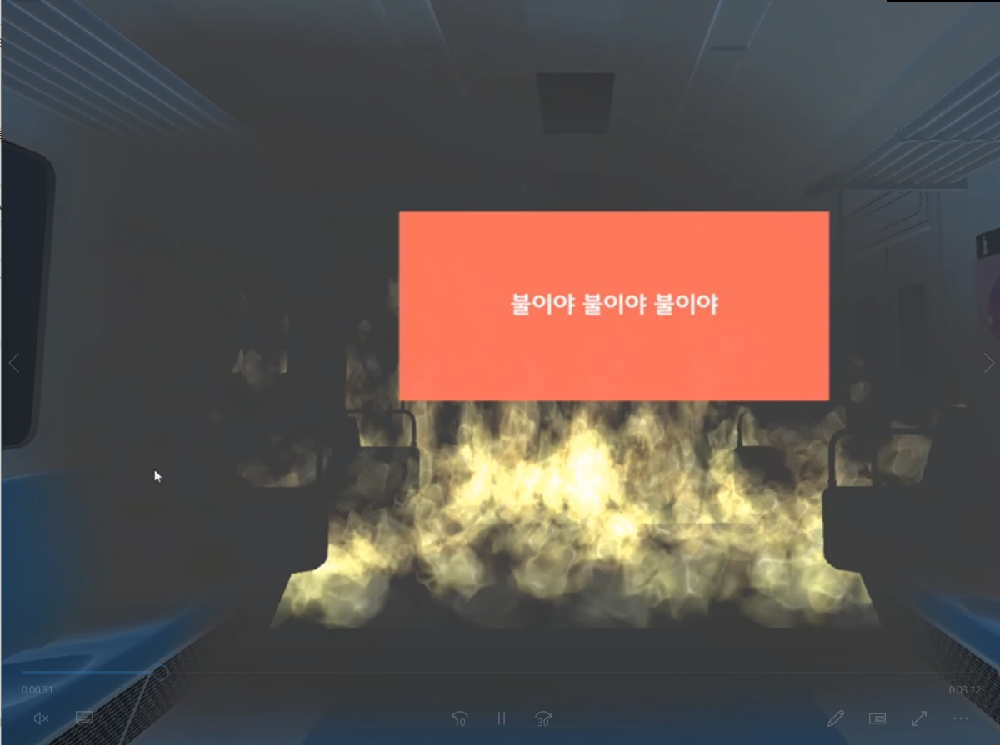
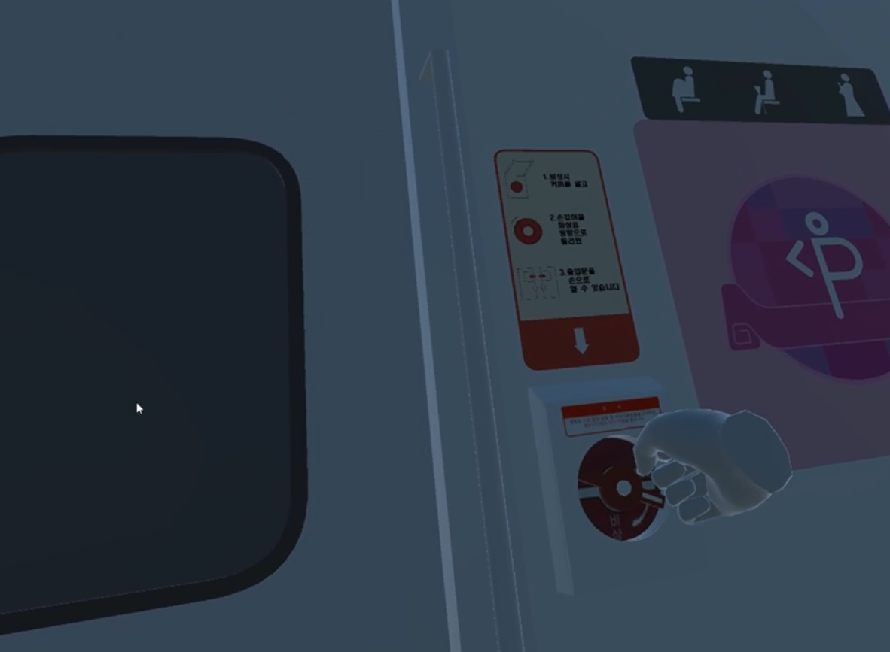
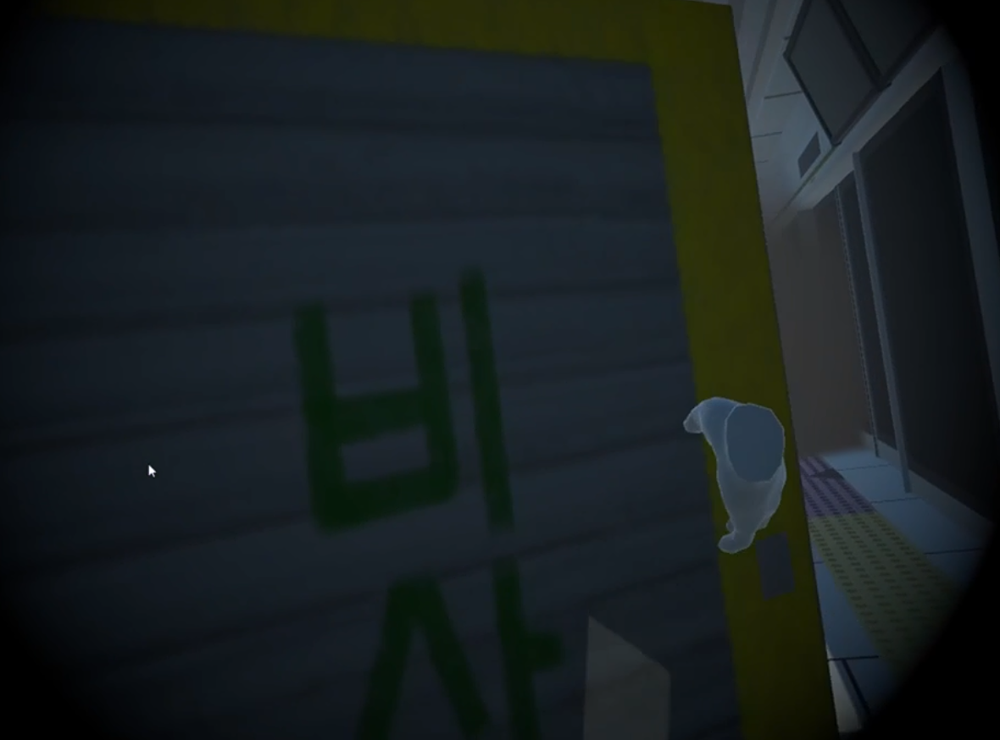

# :fire_engine: 위기탈출 1.0.1 :fire_engine: 

## :fire: 위기탈출 1.0.1 소개
위기탈출 1.0.1은 지하철 탑승 중에 화재, 수해 등 재난상황이 발생했을 때의 행동요령을 교육하는 시뮬레이션입니다. VR 및 음성인식 기술을 이용하여 현장감과 몰입도를 높이고 행동요령을 직접 체험함으로써 교육 효과를 높였습니다.

## :fire: 기획배경
최근 호우로 이수역의 사례와 같이 지하철 정거장에서 재난상황이 발생하여 이에 대한 대처의 중요성이 다시 한번 대두되고 있습니다. 현재 지하철에서 재난상황이 발생할 때, 행동요령에 대해 모르는 사람들이 많고, 이론 교육으로 습득한 사람들도 실제로 체험으로 습득할 기회가 없습니다. 위기탈출 1.0.1은 VR기기와 음성인식 기능을 이용하여 기관사에게 재난 상황을 신고하고 출입문을 수동으로 개방하는 등 평소에는 체험할 기회가 없던 행동요령을 효과적으로 교육하기 위해 개발되었습니다.

## :fire: 시나리오 시연

### 첫 화면에서 메뉴를 선택하면 안내창의 안내에 따라 진행된다.

##### 1. 메인페이지에서 화재 신으로 전환한다.

파일을 실행하면, 메인페이지에서 화재 버튼을 클릭하여 신을 넘어갑니다.

##### 2. 우선 화재상황을 인식하고 주변에 화재상황을 알리는 것으로 시작한다.

안내창에 “불이야”를 세 번 외치라는 안내창이 종료되고 빨간색 창과 함께 시작음이 울리면 불이야를 세번 외친다.

##### 3. 비상 통화 장치를 통하여 기장에게 화재사실을 알린다.

안내창이 나오면, 무전기를 잡으러 이동한다. 무전기와 상호 작용하면 빨간 안내창이 나오고, 해당 안내창에 나온 텍스트를 읽는다.

##### 4. 화재를 초기 진압한다.

통과되면 기관사가 화재의 초기 진압을 안내하며, 소화기를 집어 안전핀을 제거하는 상호 작용을 한 후, 소화기를 들고 불길이 있는 곳으로 가 불을 끈다.

##### 5. 지하철 내를 탈출한다.

불이 꺼진 후 안내창대로, 개폐장치를 돌린 후 열차 문을 수동으로 연다.

##### 6. 방독면을 착용한다.

지하철에서 탈출 후 안전 보관함으로 이동하여 문과 상호작용한 후, 방독면을 클릭하여 착용한다.

##### 7. 방화셔터를 밀고 탈출한다.

가로막고 있는 방화셔터의 입구를 찾아 상호 작용하여 문을 열고 나가 계단으로 이동하면 시연이 종료된다.

## :fire: 개발
### 기술 스택

## :fire: 아키텍쳐

## :fire: 팀 멤버

